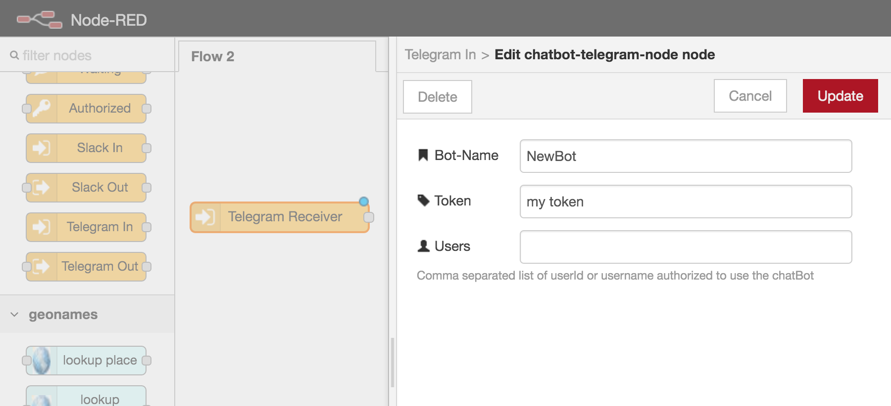
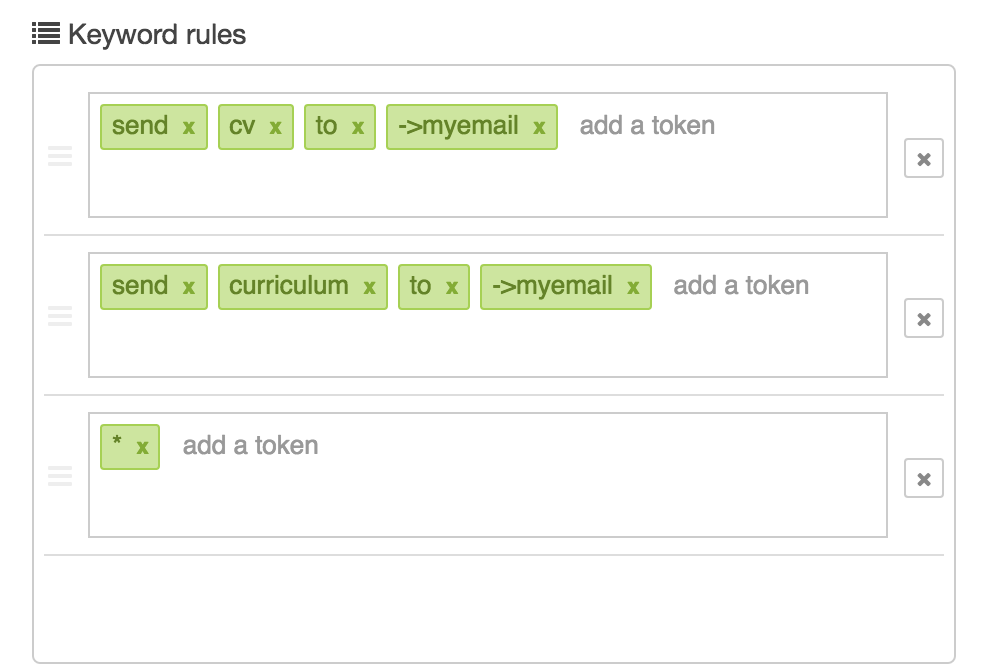

With **RedBot** you can visually build a full featured chat bot for **Telegram**, **Facebook Messenger** and **Slack** with Node-RED. ~~Almost~~ no coding skills required.


## Getting started
NodeRedContribuChatbot is a collection of nodes to be used with Node-RED.

> Node-RED is a tool for wiring together hardware devices, APIs and online services in new and interesting ways.

First of all install  [Node-RED](http://nodered.org/docs/getting-started/installation)

```
sudo npm install -g node-red
```

Then open  the user data directory `$HOME/.node-red` and install the package

```
cd $HOME/.node-red
npm install node-red-contrib-chatbot
```

Then run

```
node-red
```

The next step is to create a chat bot, I reccomend to use Telegram since the setup it's easier (Telegram allows polling to receive messages, so it's not necessary to create a https certificate).
Use **@BotFather** to create a chat bot, [follow instructions here](https://core.telegram.org/bots#botfather) then copy you access **token**.

Then open your **Node-RED** and add a `Telegram Receiver`, in the configuration panel, add a new bot and paste the **token**



Now add a `Message` node and connect to the  `Telegram Receiver`


Finally add a `Telegram Sender` node, don't forget to select in the configuration panel the same bot of the `Telegram Receiver`, this should be the final layout


Now you have a useful bot that answers *"Hi there!"* to any received message. We can do a lot better.

## Available nodes
* **Message**: sends a text message from the chat bot, supports templating (variable like `{{firstName}}`, etc), tracking of response and quoting a previous comment
* **Waiting**: sets the waiting status on the chat client (something like _your_chatbot is typing_ )
* **Command**: listen to a command type message (for example `/command1`, `/my-command`, etc)
* **Image**: takes the `msg.payload` binary (or a local file) and sends out as image to the chat, can track response
* **Audio**: takes the `msg.payload` binary (or a local file) and sends out as audio to the chat, can track response
* **Request**: request special information from the chat client like the current location or the phone numbers (Telegram).
* **Ask**: request information to the chat user using buttons using a predefined list (Telegram)
* **Parse**: Parse the incoming message searching for some type of data (string, number, date, location, contact, etc)
* **Log**: Convert a chat message (inbound or outbound) to a single line string suitable to be sent to a log file
* **Location**: Send a location type message that will be shown with a map by the chat client (Telegram)
* **Listen**:
* **Analyze**:

## Tracking answers
tbd


## Variable Contexts
**Node Red** has two variable context *global* and *flow*, the first is available everywhere in the app, the second just in the executed flow.

 **Node-red-contrib-chatbot** adds the *chat* context where is possible to store information related to the specific user. The Receiver stores here some information like *chatId*, *username*, *authorized*, etc.

To get the chat context in a function node:

```
var chatId = msg.originalMessage.chat.id
var chat = context.flow.get('chat:' + chatId);
console.log(chat.get('authorized')); // is the user authorized
console.log(chat.get('username')); // guidone72
chat.set('my_stuff', 'remember that');
```

## Examples
Here are some examples connecting the ChatBot blocks

### Basic Send Message

The first node `/hi` listen the incoming messages for the string *"/hi"*, if it finds it pass through the outpin otherwise nothing.

The second node `Hi!` simply outputs a message using the templating `Hi {{username}}!`, the message node just prepares the payload for the message, the node `Telegram Sender` actually sends out the message.

The node `Telegram Receiver` sets up some variables in the chat context flow: *firstName*, *lastName*, *chatId* , *username*, *transport*, *messageId*.
*Note*: username is only available in Telegram if it's specified in the chat settings.

### Collect Email

This is an example of how to parse the user input. The first **Email** block after the receiver just show a prompt message, note that this block tracks the user answer, that means that next message from the user will start from here and will be re-routed to the second output to the **Parse Email** block.

If a valid email is found then the parsed value will be routed to the first output otherwise the second. The parsed email is available as payload or can be stored in the flow context,  for example in the `email` variable.

The **Show Email** is just a simple message block that uses templating to show variables store in flow context (or global): `Your email is {{email}}`
### Authorized Users

In the node `Telegram Receiver` it's possible to specify a comma seprated list of authorized users (either the userId or the username), for every inbound message the `authorized` boolean variable will be updated in the chat context.

The node `Authorized?` sends the message through the first output is the user is authorized, otherwise the second output.
### Send Image

This example respons to a command `/cam` in the chat sending an image.
The first node `/cam` triggers an http request (for example to the URL of a web cam), then resulting payload is sent to the `Image` node which prepares the payload for the `Telegram Sender` node.
The **/cam** command also triggers a waiting message *"Uploading a photo..."* while the image is downloaded.
### Log Chats

The Log node takes a message payload (inbound or outbound) and trasforms it in a string suitable to be appended to a log file.

```
196520947 [Guidone72] > Thu Jun 30 2016 18:46:31 GMT+0200 - /help
196520947 [Guidone72] < Thu Jun 30 2016 18:46:31 GMT+0200 - Hi this the outbound message as answer
```

### Parse Sentences
The `Listen Node` is able to detect and parse a set of simple sentence. For example suppose we would like to offer the the chatbot user the option to request our curriculum vitae and deliver that by email


The first block listen to incoming message and verify that it matches a set of tokens, if it matches the message is routed to the first output, otherwise the second output.
The `Listen Node` is configured in this way



basically there are a set of tokens that must be present in the message in order to match. It' sufficient that one set of tokens matches to have the message routed to the first output.
The `Listen Node` also takes into account small changes to the word (using  Levenshtein distance algorithm), for example, in that case

```
"send your cv to an_email@gmail.com" // ok
"send your curriculum to an_email@gmail.com" // ok
"send your curricula to an_email@gmail.com" // ok
"send your curriculum" // no, missing email
"send to an_email@gmail.com" // no, missing cv or curriculum token
```

There are some special tokes like {{email}} that matches any token that looks like and email and store it the chat context (in that case the key will be "email").

A little bit of coding is required to prepare the payload for the email node

```
// get the chat context
var chatId = msg.originalMessage.chat.id
var chat = context.flow.get('chat:' + chatId);
// email payload
msg.to = chat.get('email');
msg.payload = 'Hi, this is my curriculum vitae';
msg.attachments = [
  {
   filename: 'my_cv.pdf',
   path: '/my_cv.pdf'
}];
return msg;
```

The first output of the `Listen Node` is also connected to a confirmation message to be sent back to the user: `Sending curriculum to {{email}}`. Here the variable `{{email}}` is automatically replaced by the value present in the chat context.


### Send a Location
tbd
### Buttons
tbd

## Roadmap
* Slack Sender & Receiver
* Facebook Sender & Receiver
* Improve interface of listen node

## Credits
* Inspired by the Karl-Heinz Wind work [node-red-contrib-telegram](https://github.com/windkh/node-red-contrib-telegrambot)
* [Telegram Bot API for NodeJS](https://github.com/yagop/node-telegram-bot-api)

## The MIT License
Permission is hereby granted, free of charge, to any person obtaining a copy
of this software and associated documentation files (the "Software"), to deal
in the Software without restriction, including without limitation the rights
to use, copy, modify, merge, publish, distribute, sublicense, and/or sell
copies of the Software, and to permit persons to whom the Software is
furnished to do so, subject to the following conditions:

The above copyright notice and this permission notice shall be included in
all copies or substantial portions of the Software.

THE SOFTWARE IS PROVIDED "AS IS", WITHOUT WARRANTY OF ANY KIND, EXPRESS OR
IMPLIED, INCLUDING BUT NOT LIMITED TO THE WARRANTIES OF MERCHANTABILITY,
FITNESS FOR A PARTICULAR PURPOSE AND NONINFRINGEMENT. IN NO EVENT SHALL THE
AUTHORS OR COPYRIGHT HOLDERS BE LIABLE FOR ANY CLAIM, DAMAGES OR OTHER
LIABILITY, WHETHER IN AN ACTION OF CONTRACT, TORT OR OTHERWISE, ARISING FROM,
OUT OF OR IN CONNECTION WITH THE SOFTWARE OR THE USE OR OTHER DEALINGS IN
THE SOFTWARE.
